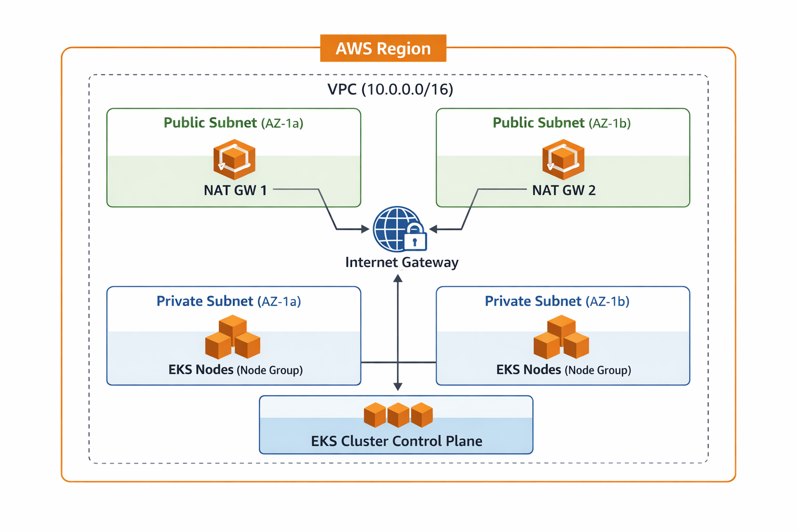

# 🚀 EKS Challenge - Infraestrutura AWS com Terraform

Este projeto implementa uma infraestrutura básica na AWS utilizando Terraform, provisionando uma VPC customizada e um cluster Amazon EKS funcional.

## 📋 Visão Geral da Solução

A solução foi desenvolvida seguindo boas práticas de Infrastructure as Code (IaC), com código modular, reutilizável e bem documentado. A arquitetura implementada inclui:

- **VPC customizada** com CIDR configurável
- **Subnets públicas e privadas** distribuídas em múltiplas zonas de disponibilidade
- **NAT Gateways** para permitir acesso à internet das subnets privadas
- **Cluster EKS** com configuração básica funcional
- **Node Group gerenciado** com auto-scaling configurado
- **Security Groups** adequados para comunicação entre componentes
- **IAM Roles e Policies** seguindo o princípio de menor privilégio

## 🏗️ Arquitetura



### Diagrama Detalhado

O diagrama acima ilustra a arquitetura completa da infraestrutura, mostrando:

- **VPC** com CIDR 10.0.0.0/16 distribuída em 2 Availability Zones
- **Subnets Públicas** contendo NAT Gateways (1 por AZ)
- **Subnets Privadas** contendo os EKS Nodes
- **Internet Gateway** para comunicação com a internet
- **EKS Cluster Control Plane** gerenciado pela AWS

### Representação em Texto

```
┌─────────────────────────────────────────────────────────────┐
│                         AWS Region                          │
│                                                             │
│  ┌──────────────────────────────────────────────────────┐  │
│  │                    VPC (10.0.0.0/16)                 │  │
│  │                                                       │  │
│  │  ┌──────────────────┐      ┌──────────────────┐     │  │
│  │  │  Public Subnet   │      │  Public Subnet   │     │  │
│  │  │   (AZ-1a)        │      │   (AZ-1b)        │     │  │
│  │  │                  │      │                  │     │  │
│  │  │  ┌────────────┐  │      │  ┌────────────┐  │     │  │
│  │  │  │ NAT GW 1   │  │      │  │ NAT GW 2   │  │     │  │
│  │  │  └────────────┘  │      │  └────────────┘  │     │  │
│  │  └──────────────────┘      └──────────────────┘     │  │
│  │         │                          │                 │  │
│  │         └──────────┬───────────────┘                 │  │
│  │                    │                                 │  │
│  │              ┌─────▼─────┐                           │  │
│  │              │ Internet  │                           │  │
│  │              │  Gateway  │                           │  │
│  │              └───────────┘                           │  │
│  │                                                       │  │
│  │  ┌──────────────────┐      ┌──────────────────┐     │  │
│  │  │ Private Subnet   │      │ Private Subnet   │     │  │
│  │  │   (AZ-1a)        │      │   (AZ-1b)        │     │  │
│  │  │                  │      │                  │     │  │
│  │  │  ┌────────────┐  │      │  ┌────────────┐  │     │  │
│  │  │  │ EKS Nodes  │  │      │  │ EKS Nodes  │  │     │  │
│  │  │  │ (Node      │  │      │  │ (Node      │  │     │  │
│  │  │  │  Group)    │  │      │  │  Group)    │  │     │  │
│  │  │  └────────────┘  │      │  └────────────┘  │     │  │
│  │  └──────────────────┘      └──────────────────┘     │  │
│  │                                                       │  │
│  │              ┌─────────────────┐                     │  │
│  │              │  EKS Cluster    │                     │  │
│  │              │  Control Plane  │                     │  │
│  │              └─────────────────┘                     │  │
│  └──────────────────────────────────────────────────────┘  │
└─────────────────────────────────────────────────────────────┘
```

### Componentes Principais

1. **VPC (Virtual Private Cloud)**
   - CIDR: 10.0.0.0/16 (configurável)
   - DNS hostnames e DNS support habilitados

2. **Subnets**
   - **Públicas**: Para recursos que precisam de acesso direto à internet (NAT Gateways)
   - **Privadas**: Para recursos que não precisam de acesso direto (EKS Nodes)
   - Distribuídas em múltiplas zonas de disponibilidade para alta disponibilidade

3. **Internet Gateway**
   - Permite comunicação entre a VPC e a internet

4. **NAT Gateways**
   - Um por zona de disponibilidade
   - Permite que recursos em subnets privadas acessem a internet para downloads e updates

5. **EKS Cluster**
   - Control plane gerenciado pela AWS
   - Endpoints públicos e privados habilitados
   - Logs de cluster habilitados (API, Audit, Authenticator, Controller Manager, Scheduler)

6. **EKS Node Group**
   - Instâncias EC2 gerenciadas pela AWS
   - Auto-scaling configurável (min, max, desired)
   - Localizado em subnets privadas

7. **Security Groups**
   - Cluster SG: Permite tráfego HTTPS (443) do VPC
   - Node Group SG: Permite comunicação entre nodes e com o cluster

8. **IAM Roles**
   - Cluster Role: Permissões para o control plane do EKS
   - Node Group Role: Permissões para os nodes (Worker Node Policy, CNI Policy, ECR ReadOnly)

## 📁 Estrutura do Projeto

```
terraform_test/
├── main.tf                 # Configuração principal e chamadas dos módulos
├── variables.tf            # Variáveis do projeto
├── outputs.tf             # Outputs do projeto
├── versions.tf            # Versões do Terraform e providers
├── .gitignore            # Arquivos ignorados pelo Git
├── README.md             # Este arquivo
└── modules/
    ├── vpc/
    │   ├── main.tf        # Recursos da VPC
    │   ├── variables.tf   # Variáveis do módulo VPC
    │   └── outputs.tf     # Outputs do módulo VPC
    └── eks/
        ├── main.tf        # Recursos do EKS
        ├── variables.tf   # Variáveis do módulo EKS
        └── outputs.tf     # Outputs do módulo EKS
```

## 🚀 Como Executar

### Pré-requisitos

1. **AWS CLI** instalado e configurado
   ```bash
   aws --version
   aws configure
   ```

2. **Terraform** instalado (versão >= 1.5.0)
   ```bash
   terraform version
   ```

3. **Credenciais AWS** configuradas com permissões adequadas para criar:
   - VPC e recursos relacionados
   - EKS clusters e node groups
   - IAM roles e policies
   - Security groups
   - NAT Gateways e Elastic IPs

### Passos para Execução

1. **Clone o repositório** (ou navegue até o diretório)
   ```bash
   cd terraform_test
   ```

2. **Inicialize o Terraform**
   ```bash
   terraform init
   ```
   Este comando baixará os providers necessários e inicializará o backend.

3. **Revise o plano de execução**
   ```bash
   terraform plan
   ```
   Este comando mostrará todos os recursos que serão criados, modificados ou destruídos.

4. **Aplique a configuração**
   ```bash
   terraform apply
   ```
   Digite `yes` quando solicitado para confirmar a criação dos recursos.

   ⚠️ **Atenção**: A criação do cluster EKS pode levar de 10 a 20 minutos.

5. **Configure o kubectl** (após o apply)
   ```bash
   aws eks update-kubeconfig --region us-east-1 --name eks-challenge-dev-cluster
   ```
   Ou use o output do Terraform:
   ```bash
   terraform output -raw configure_kubectl
   ```

6. **Verifique o cluster**
   ```bash
   kubectl get nodes
   kubectl get pods --all-namespaces
   ```

7. **Destrua os recursos** (quando terminar)
   ```bash
   terraform destroy
   ```
   ⚠️ **Importante**: Execute este comando para evitar custos desnecessários na AWS.

## ⚙️ Configuração e Variáveis

### Variáveis Principais

As variáveis podem ser configuradas através de:
- Arquivo `terraform.tfvars` (não versionado)
- Variáveis de ambiente (`TF_VAR_*`)
- Valores padrão no arquivo `variables.tf`

Principais variáveis:

| Variável | Descrição | Padrão |
|----------|-----------|--------|
| `aws_region` | Região AWS | `us-east-1` |
| `project_name` | Nome do projeto | `eks-challenge` |
| `environment` | Ambiente (dev/staging/prod) | `dev` |
| `vpc_cidr` | CIDR da VPC | `10.0.0.0/16` |
| `availability_zones` | Zonas de disponibilidade | `["us-east-1a", "us-east-1b"]` |
| `eks_cluster_version` | Versão do Kubernetes | `1.28` |
| `eks_node_instance_types` | Tipos de instância dos nodes | `["t3.medium"]` |
| `eks_node_desired_size` | Número desejado de nodes | `2` |
| `eks_node_min_size` | Número mínimo de nodes | `1` |
| `eks_node_max_size` | Número máximo de nodes | `3` |

### Exemplo de terraform.tfvars

```hcl
aws_region            = "us-east-1"
project_name          = "my-eks-project"
environment           = "dev"
vpc_cidr              = "10.0.0.0/16"
availability_zones    = ["us-east-1a", "us-east-1b"]
eks_cluster_version   = "1.28"
eks_node_instance_types = ["t3.medium"]
eks_node_desired_size = 2
eks_node_min_size     = 1
eks_node_max_size     = 3
```

## 🎯 Decisões Técnicas

### 1. Modularização
- **Decisão**: Separar VPC e EKS em módulos distintos
- **Justificativa**: Facilita reutilização, manutenção e testes. Cada módulo tem responsabilidade única.

### 2. Subnets Públicas e Privadas
- **Decisão**: Usar subnets privadas para EKS nodes e públicas para NAT Gateways
- **Justificativa**: Segurança - nodes não expostos diretamente à internet, mas com acesso outbound via NAT.

### 3. Múltiplas Zonas de Disponibilidade
- **Decisão**: Distribuir recursos em pelo menos 2 AZs
- **Justificativa**: Alta disponibilidade e resiliência a falhas.

### 4. NAT Gateway por AZ
- **Decisão**: Criar um NAT Gateway por zona de disponibilidade
- **Justificativa**: Alta disponibilidade e melhor performance. Em produção, considere custos vs. benefícios.

### 5. EKS Node Group Gerenciado
- **Decisão**: Usar Managed Node Group ao invés de Self-Managed
- **Justificativa**: Menos overhead operacional, patches automáticos, melhor integração com AWS.

### 6. Security Groups Restritivos
- **Decisão**: Configurar security groups com regras mínimas necessárias
- **Justificativa**: Segurança - princípio do menor privilégio.

### 7. Tags Consistentes
- **Decisão**: Aplicar tags em todos os recursos usando `default_tags` e tags explícitas
- **Justificativa**: Facilita gestão de custos, compliance e organização.

### 8. Logs do Cluster Habilitados
- **Decisão**: Habilitar logs do control plane do EKS
- **Justificativa**: Observabilidade e troubleshooting facilitados.

## 🔒 Backend do Terraform

### Estado Local (Atual)

O projeto está configurado para usar backend local (padrão do Terraform). O arquivo de estado (`terraform.tfstate`) é armazenado localmente.

### Backend Remoto (Recomendado para Produção)

Em um ambiente real de produção, recomenda-se usar um backend remoto para armazenar o estado do Terraform. Isso permite:

- **Estado compartilhado**: Múltiplos desenvolvedores podem trabalhar no mesmo projeto
- **Locking**: Evita conflitos quando duas pessoas tentam aplicar mudanças simultaneamente
- **Backup automático**: Estado armazenado de forma segura
- **Integração com CI/CD**: Pipelines podem acessar o estado remotamente

#### Como seria implementado em produção:

**1. Criar recursos necessários:**
- Bucket S3 para armazenar o estado (com versionamento e criptografia habilitados)
- Tabela DynamoDB para state locking
- Políticas IAM para controle de acesso

**2. Configurar no Terraform:**

Adicionar no arquivo `versions.tf`:

```hcl
terraform {
  backend "s3" {
    bucket         = "terraform-state-company-project"
    key            = "eks-challenge/terraform.tfstate"
    region         = "us-east-1"
    encrypt        = true
    dynamodb_table = "terraform-state-lock"
  }
}
```

**3. Migrar estado existente:**

```bash
terraform init  # Migra automaticamente o estado local para o S3
```

Para múltiplos ambientes, usar diferentes `key` paths (ex: `eks-challenge/dev/terraform.tfstate`, `eks-challenge/prod/terraform.tfstate`).

## 🐛 Dificuldades Encontradas

1. **Configuração de Security Groups**
   - **Desafio**: Garantir comunicação adequada entre cluster e nodes
   - **Solução**: Criar security groups específicos e configurar regras de ingress/egress apropriadas

2. **IAM Roles e Policies**
   - **Desafio**: Entender quais políticas são necessárias para EKS funcionar corretamente
   - **Solução**: Seguir documentação oficial da AWS e usar managed policies quando possível

3. **Dependências entre Recursos**
   - **Desafio**: Garantir ordem correta de criação (VPC → Subnets → EKS)
   - **Solução**: Usar `depends_on` explicitamente e aproveitar dependências implícitas do Terraform

4. **Cálculo de CIDRs para Subnets**
   - **Desafio**: Calcular CIDRs corretamente para múltiplas subnets
   - **Solução**: Usar função `cidrsubnet()` do Terraform para cálculo automático

## 📊 Pontos de Melhoria Identificados

Esta seção lista brevemente os principais pontos de melhoria que seriam implementados em um ambiente de produção real:

- **Segurança**: Implementar Network ACLs, restringir endpoints públicos do EKS, habilitar encryption at rest, usar AWS Secrets Manager
- **Observabilidade**: Integrar CloudWatch Container Insights, configurar Prometheus/Grafana, implementar logging centralizado e alertas
- **Escalabilidade**: Implementar Cluster Autoscaler, configurar HPA, considerar Fargate e múltiplos node groups
- **CI/CD**: Integrar pipelines automatizados, implementar GitOps, adicionar testes de infraestrutura
- **Backup e DR**: Configurar backups de EBS, implementar estratégia de backup do etcd, documentar procedimentos de DR
- **Custos**: Implementar Reserved Instances, usar Spot Instances onde apropriado, otimizar custos com Cost Explorer
- **Governança**: Implementar AWS Organizations, configurar AWS Config para compliance, estabelecer políticas de tagging

## 📚 Referências Utilizadas

- [Terraform AWS Provider Documentation](https://registry.terraform.io/providers/hashicorp/aws/latest/docs)
- [Amazon EKS User Guide](https://docs.aws.amazon.com/eks/latest/userguide/)
- [AWS VPC Best Practices](https://docs.aws.amazon.com/vpc/latest/userguide/vpc-security-best-practices.html)
- [Conventional Commits](https://www.conventionalcommits.org/)
- [Terraform Best Practices](https://www.terraform.io/docs/cloud/guides/recommended-practices/index.html)

---

Sempre execute `terraform destroy` após concluir os testes para evitar custos desnecessários na AWS.

