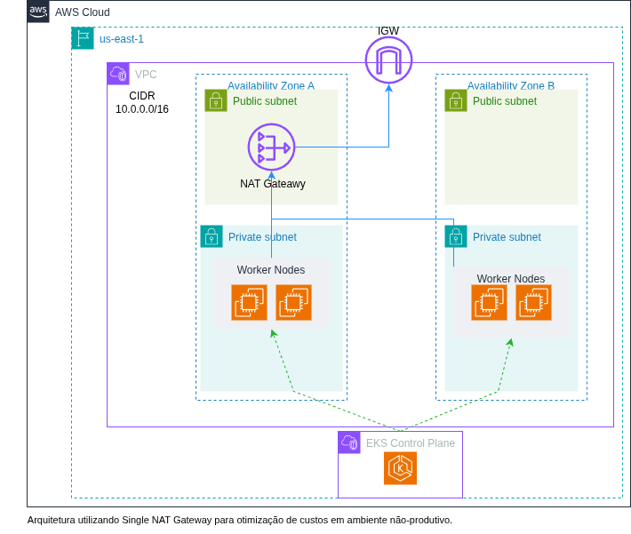
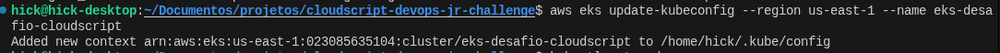
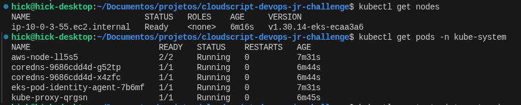
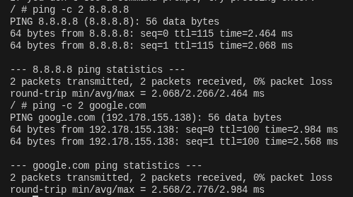

# Desafio CloudScript

## Introdução
Este projeto apresenta uma implementação de infraestrutura em nuvem na AWS, composta por uma **VPC customizada** e um **Cluster EKS funcional**. A solução foi desenvolvida utilizando **Terraform** seguindo práticas de Infraestrutura como Código (IaC).

## Arquitetura


O diagrama acima ilustra a arquitetura baseada em **alta disponibilidade** e **segurança**.

### Principais componentes:
- **VPC Customizada:** Rede criada do zero para controle granular.
- **Multi-AZ:** Distribuição em 2 Zonas de Disponibilidade (`us-east-1a`, `us-east-1b`) para tolerância a falhas.
- **Segmentação de Rede:**
  - **Subnets Públicas:** Destinadas ao NAT Gateway e Load Balancers externos.
  - **Subnets Privadas:** Destinadas aos Worker Nodes e interfaces do Control Plane (segurança reforçada).
- **Cluster EKS:** Provisionado via módulo oficial (`terraform-aws-modules/eks/aws`) versão ~> 20.0.
- **Managed Node Groups:** Instâncias EC2 gerenciadas pela AWS rodando **Amazon Linux 2023**.

## Decisões Técnicas
Durante o desenvolvimento, as seguintes decisões estratégicas foram tomadas:

1. **Distribuição Multi-AZ:** Optei por utilizar 2 AZs para os Worker Nodes. Mesmo sendo um ambiente de teste, isso demonstra conformidade com boas práticas de resiliência.

2. **Single NAT Gateway:**
   Utilizei a estratégia de *Single NAT Gateway* (um gateway compartilhado na subnet pública A atendendo as subnets privadas A e B). Isso reduz custos drasticamente para o desafio, mantendo a funcionalidade de saída de internet segura para os nós.

3. **Módulo do Cluster EKS:**
   A escolha pelo módulo oficial da comunidade visa abstrair a complexidade de configuração de IAM Roles e Security Groups, garantindo um cluster *Secure by Default* e de fácil manutenção.

4. **Estado Terraform (Backend):**
   A configuração de backend S3 está presente no arquivo `provider.tf`, porém comentada. Isso facilita a execução local pelo avaliador sem a necessidade de pré-provisionamento de buckets e travas no DynamoDB.

## Pré-requisitos
Para executar este projeto, certifique-se de ter em seu ambiente:
- **Terraform** (v1.5 ou superior) instalado;
- **AWS CLI** configurado com credenciais válidas;
- **kubectl** instalado (opcional, para validação do cluster).

## Execução
Clone este repositório, acesse o diretório raiz e siga os passos abaixo no terminal:

1. **Inicialize o Terraform:**
   Baixa os providers e módulos necessários.
   ```bash
   terraform init
   ```

2. **Planeje a execução:** Gera um arquivo de plano para visualizar as mudanças.
   ```bash
   terraform plan -out plan.out
   ```

3. **Aplique a infraestrutura:** Provisiona os recursos na AWS.
   ```bash
   terraform apply plan.out
   ```

4. **Configure o acesso ao Cluster (kubectl):** Após o fim da criação, copie e execute o comando exibido no output `configure_kubectl`:
   ```bash
   aws eks update-kubeconfig --region us-east-1 --name eks-desafio-devops
   ```

1.Configuração do kubectl. </br>
</br>

2.Vizualiação dos nodes </br>
</br>
 
3.Teste de ping dentro do pod. </br>
</br>
5. **Limpeza do Ambiente:** Ao finalizar os testes, destrua a infraestrutura para evitar cobranças:
   ```bash
   terraform destroy -auto-approve
   ```
